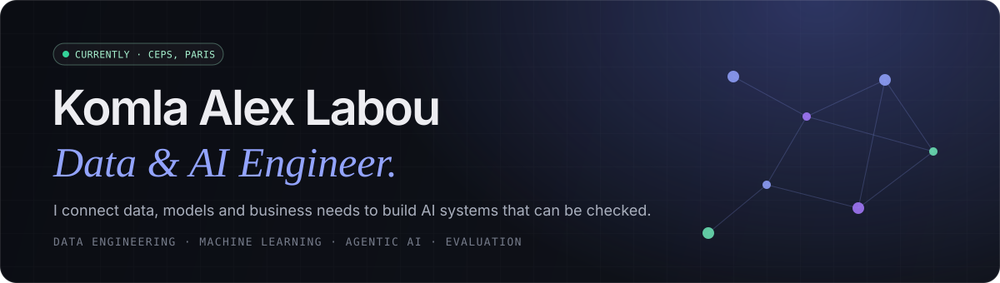
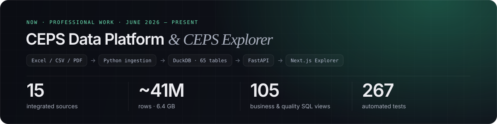
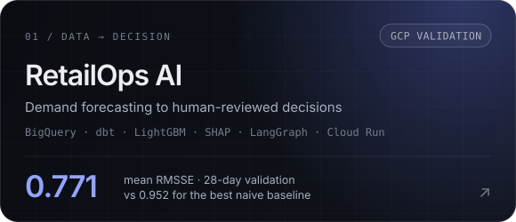
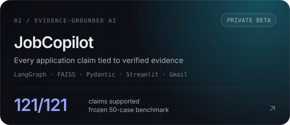
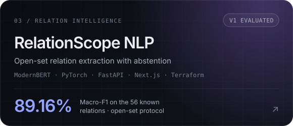
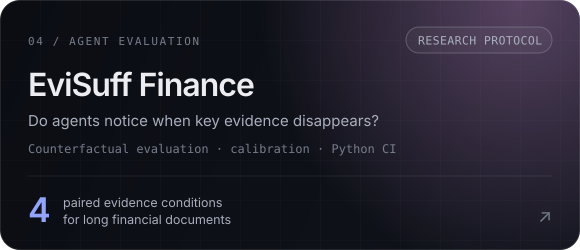

  

  
  
  
  

  <strong>Data & AI Engineer · ENSAI Rennes & ENSAE Dakar · based in France</strong> 
  I build data platforms, models and agents whose evidence can be checked, performance measured and limitations understood.

---

## Now · CEPS Data Platform & Explorer

At the **CEPS** (Economic Committee for Health Products, Paris), I am the **sole designer and developer** of the data platform and business application used to prepare medicine-price negotiations.

- **The problem:** sales, reimbursement, hospital, rebate and regulatory data scattered across files with competing identifiers.
- **What I built:** source adapters, identifier normalization, history preservation, 113 versioned SQL migrations, a read-only FastAPI service and a Next.js application for business teams — growth decomposition by price, volume and mix, HAS pathways, exports and product PDFs.
- **Traceability by design:** 442 files tracked by SHA-256, 675 logged ingestion runs, 3,922 recorded data-quality issues, human-approved corrections. No invented identifier mapping; missing stays missing.
- **Next:** user acceptance testing and migration to the ministry's infrastructure (PostgreSQL, Docker).

Code and data are internal to CEPS · figures as of 30 September 2026 · <a href="https://alex-labou.vercel.app/en/projects/ceps">full case study →</a>

---

## Selected projects

<table>
  <tr>
    <td width="50%" valign="top">
      
      
Recursive 28-day forecasts turned into explicit inventory scenarios, TreeSHAP explanations and a LangGraph copilot with bounded tools. Leakage-safe dbt layers on BigQuery, training validated on Cloud Run Jobs.

      Private repository · <a href="https://alex-labou.vercel.app/en/projects/retailops-ai">case study</a> · walkthrough on request
    </td>
    <td width="50%" valign="top">
      
      
Turns a verified candidate profile and a job offer into a reviewable application pack — without inventing skills. Evidence ledger, deterministic claim composition, tenant-isolated memory, supervised Gmail drafts.

      <a href="https://github.com/EL-K-Code/Job-Copilot">Source</a> · <a href="https://alex-labou.vercel.app/en/projects/jobcopilot">case study</a>
    </td>
  </tr>
  <tr>
    <td width="50%" valign="top">
      
      
Relation classification that calibrates its confidence and abstains on unknown relations: 84.45% unknown rejection, 16 unseen relations held out for the final test. FastAPI/Next.js serving on GCP with Terraform.

      Private repository · <a href="https://alex-labou.vercel.app/en/projects/relationscope-nlp">case study</a> · with Maxime Ferret (ENSAI)
    </td>
    <td width="50%" valign="top">
      
      
A counterfactual protocol testing whether long-document agents change their answer when answer-critical evidence is removed. Paired bootstrap intervals, abstention and citation metrics, CI-checked benchmark integrity.

      <a href="https://github.com/EL-K-Code/evisuff-finance">Source</a> · research protocol, no empirical model claims yet
    </td>
  </tr>
</table>

  
<strong>More engineering work</strong>

   

- **[IMDB Data Platform](https://github.com/EL-K-Code/imdb-data-platform)** — TSV → Parquet → GCS → BigQuery ingestion with chunked processing and a reproducible bronze layer.
- **[KandiaAI](https://github.com/EL-K-Code/kandiai)** — human-centered career intelligence for African professionals, preserving truthful profile representation.
- **[ML Model Serving & Deployment](https://github.com/EL-K-Code/gender-prediction-api)** — FastAPI, Docker, PostgreSQL, Cloud Run and GitHub Actions.
- **[Agentic AI](https://github.com/EL-K-Code/Agentic-AI)** — agent orchestration, tools and structured workflows.
- **[RAG Playground](https://github.com/EL-K-Code/rag-playground)** — compact retrieval-augmented generation experiments.

---

## Proof, not promises

| Project | Result | Protocol |
| --- | --- | --- |
| **RetailOps AI** | **0.771** mean RMSSE vs 0.952 (best naive baseline) | Same 28-day validation window, 2.7M training rows — not the official M5 WRMSSE |
| **JobCopilot** | **121/121** claims supported · **22/22** in a 10-offer end-to-end audit | Frozen 50-case grounding benchmark, zero detected technology contamination |
| **RelationScope** | **89.16%** Macro-F1 · **84.45%** unknown rejection | Open-set protocol: 56 known relations, 16 unseen held out from calibration |
| **WFP biometrics** | **EER 4.34%** · **AUC 0.981** · **Rank-1 94.5%** | SOCOFing fingerprints, threshold and robustness analysis |

Every metric comes with its protocol, and every project states its limits.

---

## Experience

<table>
  <tr>
    <td width="50%" valign="top">
      JUNE 2026 — PRESENT · PARIS
      <h4>Data Science & Data Engineering · CEPS</h4>
      Sole developer of the CEPS Data Platform and CEPS Explorer: 15 sources, history, quality controls, economic analysis, FastAPI and Next.js.
    </td>
    <td width="50%" valign="top">
      JULY — DEC. 2025 · ROME
      <h4>Data Scientist · World Food Programme (UN)</h4>
      Fingerprint duplicate-detection prototype for beneficiary identification: MinutiaeNet minutiae extraction and Bozorth3-inspired matching.
    </td>
  </tr>
  <tr>
    <td width="50%" valign="top">
      2024 — 2026
      <h4>ENSAI Rennes · Data Science & Data Engineering</h4>
      Machine learning, deep learning, NLP, cloud and data engineering. Team research on SLA-aware serverless placement across cloud, fog and edge (auction, greedy and RL strategies).
    </td>
    <td width="50%" valign="top">
      2020 — 2024
      <h4>ENSAE Dakar · Engineering degree in Statistics & Economics</h4>
      Statistics, econometrics, inference and survey analysis. Research assistant and data analyst roles in Dakar.
    </td>
  </tr>
</table>

---

## Toolkit

  

<table>
  <tr>
    <td width="50%" valign="top"><strong>AI / ML / NLP</strong> PyTorch · TensorFlow · scikit-learn · Hugging Face · LightGBM · SHAP · Sentence Transformers</td>
    <td width="50%" valign="top"><strong>LLM systems</strong> LangGraph · RAG · tool calling · structured outputs · FAISS · Pydantic · evidence grounding</td>
  </tr>
  <tr>
    <td width="50%" valign="top"><strong>Data</strong> SQL · DuckDB · BigQuery · dbt · PostgreSQL · data quality & lineage</td>
    <td width="50%" valign="top"><strong>Delivery</strong> FastAPI · Next.js · Docker · GCP · AWS · Terraform · GitHub Actions · GitLab CI</td>
  </tr>
</table>

---

  <strong>Building data platforms, reliable agents or evaluation-driven ML?</strong> 
  <a href="https://alex-labou.vercel.app/en">Portfolio</a> · <a href="https://www.linkedin.com/in/komla-alex-labou/">LinkedIn</a> · <a href="mailto:alexlabou03@gmail.com">alexlabou03@gmail.com</a>

