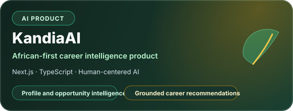
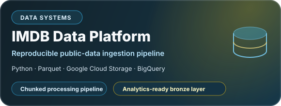

<p align="center">
  
</p>

<p align="center">
  <a href="https://www.linkedin.com/in/komla-alex-labou/">
    
  </a>
  <a href="https://github.com/EL-K-Code">
    
  </a>
  
  
</p>

<p align="center">
  <strong>Data Science Engineer trained at ENSAI Rennes and ENSAE Dakar.</strong><br/>
  I design AI systems that retrieve evidence, reason over it and expose outputs that can be evaluated, audited and safely acted on.
</p>

---

## 01 · Engineering profile

I work at the intersection of **applied AI research and product engineering**. My projects are built around a simple principle: an AI system should not only generate a plausible answer — it should make its evidence, limitations and operational behavior inspectable.

<table>
  <tr>
    <td width="33%" valign="top">
      <h3>Agentic AI systems</h3>
      LangGraph orchestration, tool calling, semantic memory, structured outputs, tenant isolation and human-controlled actions.
    </td>
    <td width="33%" valign="top">
      <h3>Evaluation & reliability</h3>
      Evidence grounding, sufficiency testing, calibration, abstention, counterfactual evaluation and reproducible error analysis.
    </td>
    <td width="33%" valign="top">
      <h3>Production-minded ML</h3>
      APIs, Docker, CI/CD, cloud data pipelines, observability, quotas and deployment-oriented system design.
    </td>
  </tr>
</table>

---

## 02 · Flagship systems

<table>
  <tr>
    <td width="50%" valign="top">
      <a href="https://github.com/EL-K-Code/Job-Copilot">
        
      </a>
      <p><strong>Why it matters:</strong> transforms verified candidate evidence and a job description into a channel-aware application pack without inventing skills or experience.</p>
    </td>
    <td width="50%" valign="top">
      <a href="https://github.com/EL-K-Code/evisuff-finance">
        
      </a>
      <p><strong>Why it matters:</strong> studies whether long-document agents react correctly when answer-critical evidence is present, removed or replaced.</p>
    </td>
  </tr>
  <tr>
    <td width="50%" valign="top">
      <a href="https://github.com/EL-K-Code/kandiai">
        
      </a>
      <p><strong>Why it matters:</strong> explores human-centered career intelligence for African professionals while preserving truthful profile representation.</p>
    </td>
    <td width="50%" valign="top">
      <a href="https://github.com/EL-K-Code/imdb-data-platform">
        
      </a>
      <p><strong>Why it matters:</strong> demonstrates reproducible ingestion, chunked processing and analytics-ready cloud data preparation.</p>
    </td>
  </tr>
</table>

<details>
  <summary><strong>More selected engineering work</strong></summary>
  <br/>

- **[ML Model Serving & Deployment Demo](https://github.com/EL-K-Code/gender-prediction-api)** — FastAPI, Docker, PostgreSQL, Cloud Run and GitHub Actions.
- **[Agentic AI](https://github.com/EL-K-Code/Agentic-AI)** — experiments with agent orchestration, tools and structured workflows.
- **[RAG Playground](https://github.com/EL-K-Code/rag-playground)** — compact retrieval-augmented generation experiments.

</details>

---

## 03 · Proof, not promises

### JobCopilot evaluation

- **Frozen grounding benchmark:** 50/50 cases completed, with **121/121 candidate claims supported** by explicit profile evidence.
- **OpenAI end-to-end audit:** 10/10 job offers completed, with **22/22 claims supported**, no ledger issue and **zero detected technology contamination**.
- The system uses an auditable evidence ledger, deterministic claim composition, provider telemetry, quotas and tenant-isolated workspaces.

### Research engineering discipline

- reproducible protocols and frozen evaluation cases;
- explicit limitations instead of inflated claims;
- CI-backed regression checks and benchmark-integrity validation;
- human verification before profile facts become active evidence.

---

## 04 · Technical toolkit

<p align="center">
  
</p>

<p align="center">
  
  
  
  
  
  
  
</p>

<table>
  <tr>
    <td width="50%" valign="top">
      <strong>AI & ML</strong><br/>
      PyTorch · TensorFlow · scikit-learn · Hugging Face · Sentence Transformers · Reinforcement Learning
    </td>
    <td width="50%" valign="top">
      <strong>LLM systems</strong><br/>
      LangGraph · RAG · tool calling · structured outputs · semantic retrieval · evidence grounding
    </td>
  </tr>
  <tr>
    <td width="50%" valign="top">
      <strong>Backend & data</strong><br/>
      FastAPI · Streamlit · SQL · PostgreSQL · DuckDB · BigQuery · REST APIs
    </td>
    <td width="50%" valign="top">
      <strong>Cloud & engineering</strong><br/>
      Docker · GitHub Actions · Google Cloud · AWS · Terraform · Git
    </td>
  </tr>
</table>

---

## 05 · Applied research experience

<table>
  <tr>
    <td width="50%" valign="top">
      <h3>Biometric duplicate detection · World Food Programme</h3>
      Designed and evaluated a fingerprint duplicate-detection prototype combining deep-learning-based minutiae extraction and graph-based matching. Evaluation covered ROC-AUC, equal error rate, FAR/FRR, threshold analysis, robustness and Rank-1 identification.
    </td>
    <td width="50%" valign="top">
      <h3>Smart bidding across cloud-to-edge · Team project</h3>
      Contributed within a three-person final-year research team to SLA-aware serverless placement across heterogeneous cloud, fog and edge nodes, comparing auction, greedy and reinforcement-learning strategies in FaaS-Sim.
    </td>
  </tr>
</table>

---

## 06 · Current focus

```text
Reliable agents       → evidence sufficiency, grounding and calibrated abstention
JobCopilot            → persistent beta infrastructure and real-user validation
EviSuff Finance       → human-verified evaluation for long-document agents
Career direction      → AI/ML engineering, Generative AI and research-oriented roles
```

---

<p align="center">
  <strong>Interested in reliable AI systems, agent evaluation or production-minded machine learning?</strong><br/>
  <a href="https://www.linkedin.com/in/komla-alex-labou/">Let’s connect on LinkedIn</a>
</p>
